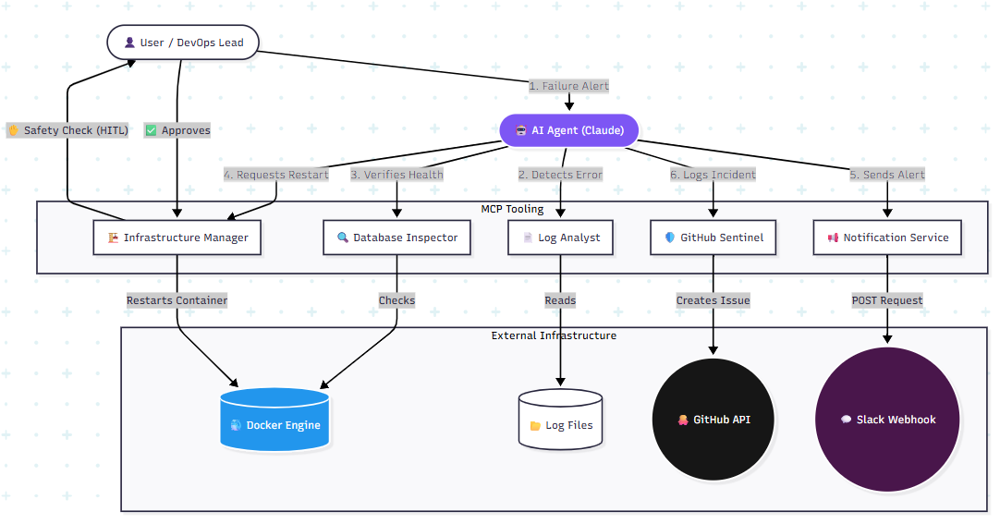

# Autonomous-Incident-Response-Platform (MCP-Powered Agentic SRE)

An intelligent SRE (Site Reliability Engineering) ecosystem that leverages the **Model Context Protocol (MCP)** to automate the triage and remediation of microservice failures.
The platform eliminates the manual hours typically spent by engineers diagnosing root causes during system outages. Upon receiving an alert, the system automatically orchestrates a fleet of AI agents to analyze distributed logs, inspect database performance, and execute infrastructure remediations - simultaneously documenting the entire lifecycle via GitHub Reports and Slack notifications.

---

## 🏗 System Architecture



The platform is built on a "Three-Zone" architecture that integrates diagnostic intelligence with automated action:

1.  **The Problem Layer (Microservices):** A suite of containerized services (Payment, Inventory, Auth) that simulate real-world production issues such as database connection timeouts, high latency, and configuration errors.
2.  **The Inspector Layer (MCP Servers):** A set of specialized tools that grant an AI agent direct access to the system:
    * **Log Analyst:** Performs automated error-pattern recognition across distributed service logs.
    * **Database Inspector:** Monitors PostgreSQL for performance bottlenecks and manages long-running queries.
    * **Infrastructure Manager:** Provides direct orchestration of Docker containers to perform health checks and restarts.
3.  **The Communication Layer:** Automated reporting via **GitHub Sentinel** for incident tracking and **Slack Notification Services** for real-time DevOps alerts.

---

## ⚡ The Alert-to-Resolution Workflow

This platform is designed to handle the "Heavy Lifting" of incident response automatically:

1.  **Detection:** An alert triggers the AI Agent to investigate a specific service failure.
2.  **Autonomous Diagnosis:** Instead of an engineer manually running queries, the AI uses the **Log Analyst** and **Database Inspector** to find the root cause in seconds.
3.  **Automated Remediation:** The AI executes a precise fix—such as killing a specific blocked database PID or restarting a crashed container - via the **Infrastructure Manager**.
4.  **Audit & Notification:** The system simultaneously posts a full incident report to **GitHub Issues** and sends a summary of the fix to **Slack**, keeping the human team informed without requiring their manual intervention.

---

## 🚀 Key Features

* **Autonomous Triage:** The AI agent analyzes structured JSON logs using Pandas to identify root causes without manual engineer intervention.
* **Database Self-Healing:** Capability to detect and terminate stuck database processes (PIDs) that cause system-wide hangs.
* **Safety Guardrails:** Implements **Human-in-the-Loop (HITL)** safety checks, requiring explicit confirmation before the AI executes destructive actions like container restarts.
* **Polyglot Integration:** A seamless mix of Python-based data analysis and Node.js-based infrastructure management unified under a single protocol.

---

## 🛠 Technology Stack

| Category | Tools |
| :--- | :--- |
| **Protocol** | Model Context Protocol (MCP) |
| **Languages** | Python 3.9, TypeScript, Node.js |
| **Infrastructure** | Docker, Docker Compose, PostgreSQL |
| **Libraries** | Pandas, FastAPI, Dockerode, Psycopg2 |
| **Notifications** | Slack Webhooks, GitHub API |

---

## 📖 Getting Started

### 1. Prerequisites
* Docker and Docker Compose installed.
* An MCP-compatible client (such as Claude Desktop).
* GitHub Personal Access Token and a Slack Webhook URL.

### 2. Configuration
Create a `.env` file in the root directory based on the provided example:
```env
GITHUB_TOKEN=your_github_token
REPO_OWNER=your_username
REPO_NAME=your_repo_name
SLACK_WEBHOOK_URL=your_slack_webhook
```

### 3. Deployment

``` Bash
docker-compose up -d
```
Connect the MCP servers located in the mcp-servers/ directory to your client configuration to begin autonomous monitoring.